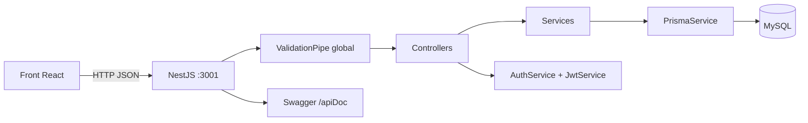

# Eduka Back — contexte Claude Code

> Référence analysée : `yeslifeprod-rgb/Eduka-back`, branche `main`, commit `937c15d7598ba8c340f03897782a6340c13b551d`.
> Ce document décrit l'état réel du code, y compris les modules encore générés comme squelettes NestJS.

## Produit

API d'Eduka, application scolaire reliant parents, établissements, enseignants, enfants et événements. Le domaine inclut les profils, écoles, rôles, disciplines, événements, tags, participations et messages.

## Stack

- Node.js + TypeScript
- NestJS 10
- Prisma 5
- MySQL via `DATABASE_URL`
- JWT + Passport
- bcrypt
- class-validator / class-transformer
- Swagger
- Jest + Supertest

## Architecture

```text
src/
├── main.ts                  # bootstrap, ValidationPipe, Swagger, port 3001
├── app.module.ts            # composition des modules métier
├── auth/                    # connexion et création JWT
├── user/                    # utilisateurs, profils, rôles utilisateur
├── school/                  # établissements et liens user-school
├── children/                # enfants
├── discipline/              # disciplines et liens user-discipline
├── event/                   # événements, tags liés et participations
├── event_tag/               # catalogue des tags d'événement
├── message/                 # messages liés aux utilisateurs/événements
├── address/                 # adresses
└── role/                    # rôles
prisma/
├── schema.prisma            # schéma MySQL et relations
├── prisma.module.ts
└── prisma.service.ts
```

Chaque domaine NestJS suit le triplet `module` → `controller` → `service`, avec des DTO `create`/`update` et parfois une entité TypeScript.

## Flux principal



## Modules enregistrés

`AppModule` charge :

- `UserModule`
- `PrismaModule`
- `EventModule`
- `ChildrenModule`
- `RoleModule`
- `SchoolModule`
- `DisciplineModule`
- `AddressModule`
- `MessageModule`
- `EventTagModule`
- `AuthModule`
- `ConfigModule` global

## API actuelle

- `POST /auth/signin` : recherche l'utilisateur par email, compare bcrypt, retourne `access_token` signé avec `SECRET_KEY`, expiration 30 minutes.
- `POST /users/change-password` : change le mot de passe à partir de `userId` et `newPassword`.
- Ressources CRUD exposées par controllers : `/address`, `/children`, `/discipline`, `/event`, `/event-tag`, `/message`, `/role`, `/school`.
- Swagger : `/apiDoc`.
- Port fixe actuel : `3001`.

Important : la majorité des services CRUD générés retournent encore des chaînes de caractères de démonstration. `UserService` utilise réellement Prisma ; ne pas considérer tous les endpoints CRUD comme fonctionnels sans lire leur service.

## Modèle de données Prisma

Entités principales :

- `User` : email unique, mot de passe hashé, statut, profil, rôles, écoles, disciplines, enfants, événements et messages.
- `Profile` : identité/photo, relation 1–1 avec `User`, relation vers `Address`.
- `School` : établissement et adresse optionnelle.
- `Children` : enfant rattaché à un utilisateur et une école.
- `Event` : dates, visibilité, catégorie, statut, adresse, auteur, messages, tags et participations.
- `Message` : contenu rattaché à un utilisateur et un événement.
- `Discipline`, `Role`, `EventTag` : catalogues enumérés.

Tables de liaison :

- `UserHasDisciplines`
- `UserHasSchool`
- `RoleHasUser`
- `EventHasEventTag`
- `ProfilAttendanceEvent` (participation d'un enfant à un événement)

Rôles Prisma actuels : `PARENT`, `PARENT_TEACHER`, `SCHOOL`. Le front référence aussi `TEACHER`, absent de l'enum back.

## Variables d'environnement

```text
DATABASE_URL   # connexion MySQL Prisma
SECRET_KEY     # signature JWT
```

Ne jamais committer leurs valeurs. Fournir uniquement un `.env.example` documenté.

## État réel et incompatibilités connues

- Le front appelle `POST auth/signInJulien`, tandis que le back expose `POST /auth/signin`.
- Le front attend un couple access/refresh tokens et `POST auth/refresh_token`; le back ne retourne qu'`access_token` et n'expose pas le refresh analysé.
- Le front appelle `/event/public`, `/event/my_events`, `/event/my_participation`; le controller événement actuel n'expose que le CRUD générique.
- Le front appelle `/user/profile`; le controller est monté sur `/users` et n'expose que `change-password`.
- Aucun garde JWT global ou par route n'est visible dans l'architecture actuelle.
- `change-password` accepte directement un `userId`; avant production, l'identité doit venir du JWT et le mot de passe ne doit jamais être renvoyé.
- Les services CRUD scaffoldés doivent être connectés à Prisma et testés avant d'être annoncés fonctionnels.
- Certains imports Prisma utilisent l'alias absolu `prisma/...`; conserver la configuration Nest/TS existante ou normaliser de façon cohérente.

## Conventions pour les modifications

1. Pour une fonctionnalité métier, modifier ensemble DTO, controller, service, schéma Prisma si nécessaire et tests.
2. Controller mince : validation/HTTP seulement. Logique métier dans le service. Accès DB via `PrismaService`.
3. Utiliser les DTO avec `class-validator`; ne pas accepter directement des objets non validés.
4. Ne jamais retourner `password` ni un secret dans une réponse.
5. Protéger les routes privées avec un garde JWT et dériver l'utilisateur du token.
6. Toute modification de `schema.prisma` doit inclure la migration et `prisma generate`.
7. Aligner explicitement le contrat avec les fonctions de `Eduka-front/src/services/api`.
8. Conserver les noms de domaine existants ; éviter de créer un nouveau module pour une logique déjà couverte.
9. Remplacer progressivement les stubs NestJS par des implémentations Prisma testées, sans inventer de données.

## Commandes de vérification

Le dépôt ne contient pas actuellement de lockfile npm versionné ; après installation cohérente, en créer un et utiliser ensuite `npm ci`.

```bash
npm install
npx prisma generate
npm run build
npm run lint
npm test -- --runInBand
npm run test:e2e
```

Les tests nécessitant MySQL demandent une `DATABASE_URL` de test isolée. Avant de terminer une tâche : compiler, tester le service concerné, contrôler le contrat Swagger et vérifier qu'aucune donnée sensible n'est exposée.
